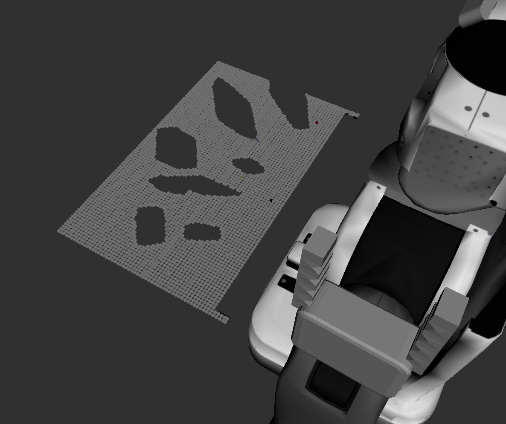
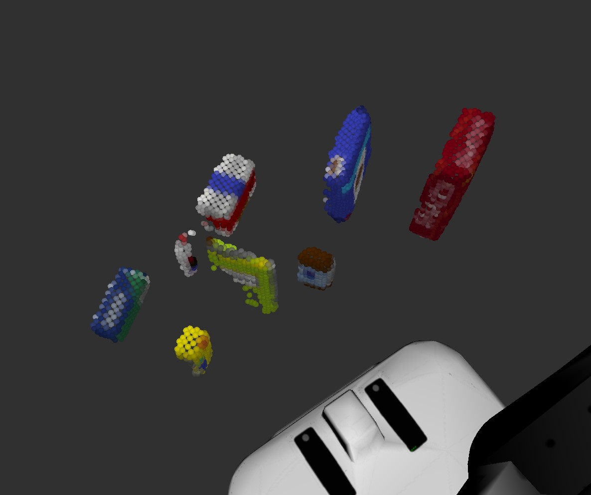
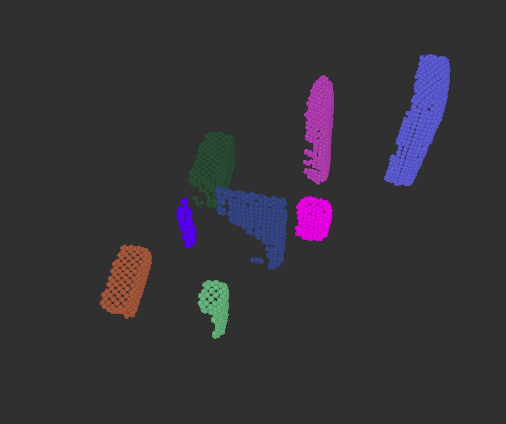
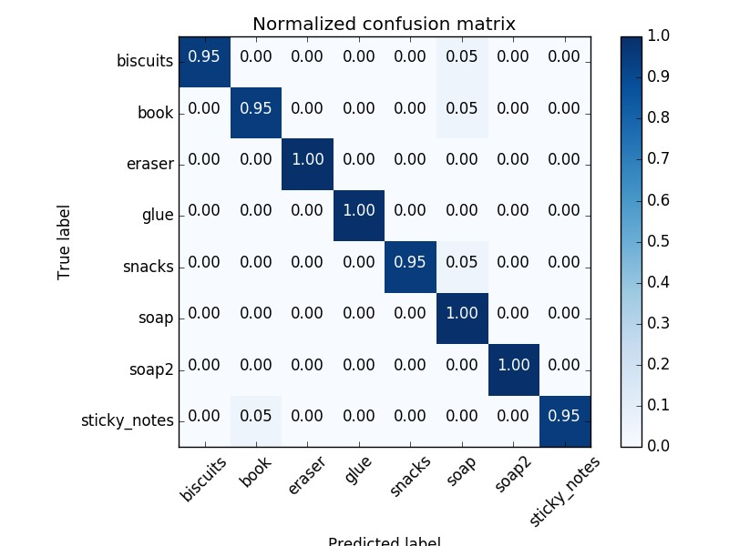
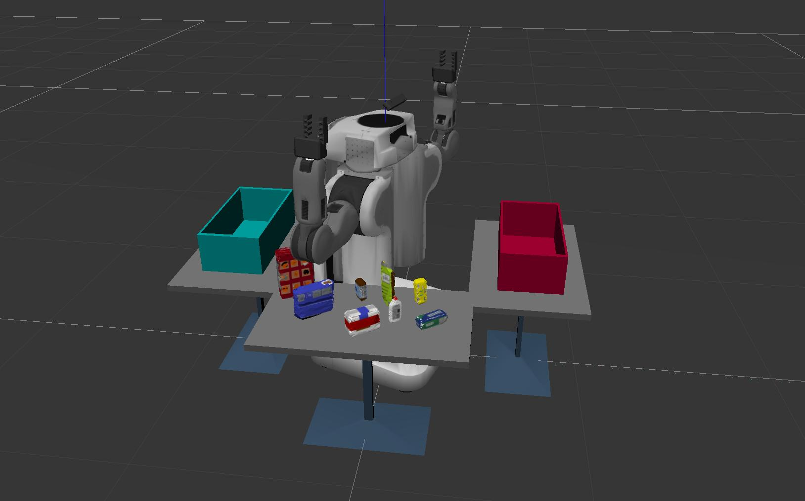
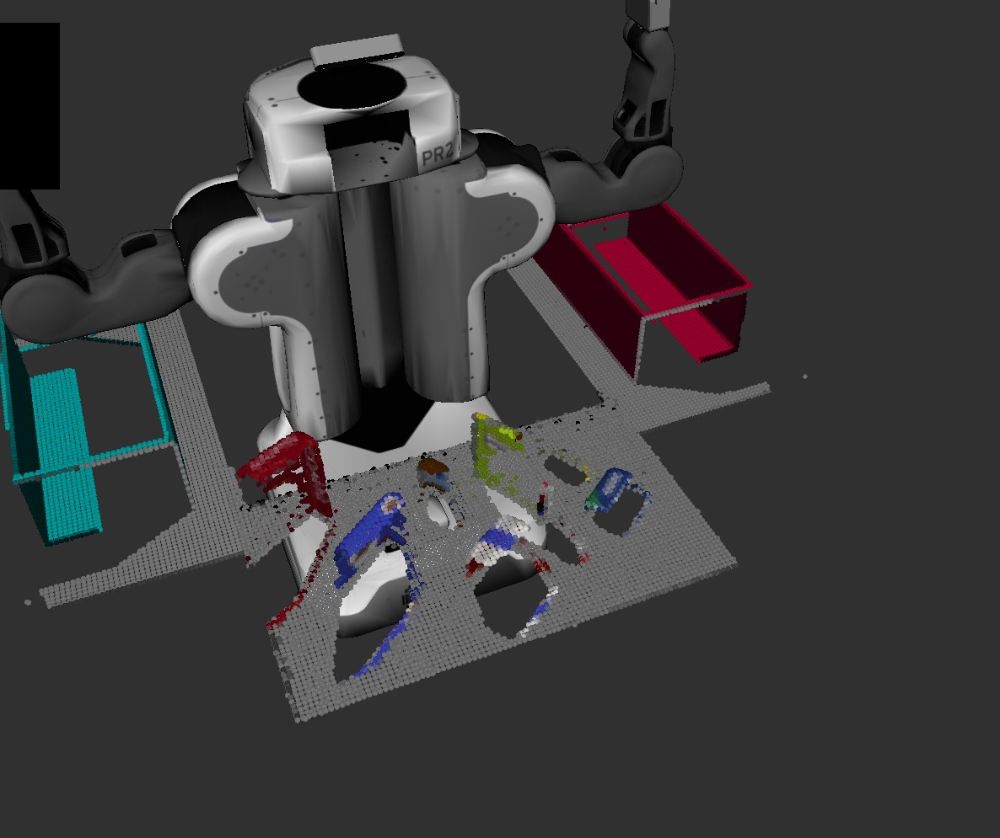
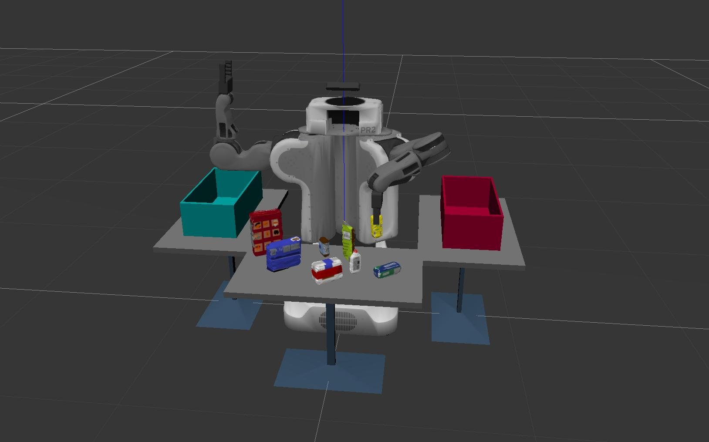
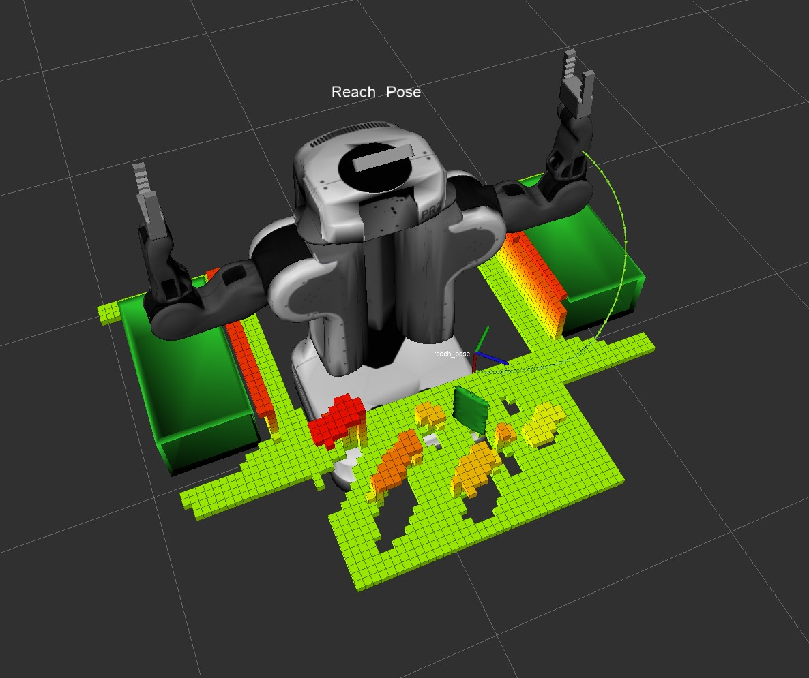

## Project: Perception Pick & Place

### Exercise 1, 2 and 3 pipeline implemented

#### 1. Complete Exercise 1 steps. Pipeline for filtering and RANSAC plane fitting implemented.

To filter out camera noise from the captured image statistical outlier filter is created (*line #64*). Relatively small number of evaluated neighboring points for every cycle and the negative threshold make the filtering quite aggressive. Thus there are still enough points for reliable object recognition while noise is filtered out almost completely.

Voxel grid filter (*line #70*) downsamples the image to reduce the number of further calculations.

Pass through filter allows to clip out unneeded parts of 3D image so it is applied several times along different axes (*lines #76,96,114,138*). The front table edge is also clipped out with this filter.

By RANSAC plane segmentation the point cloud is separated into table plane and objects (*lines #146-158*).

#### 2. Complete Exercise 2 steps: Pipeline including clustering for segmentation implemented.  

Objects are separated by means of euclidean clustering (lines #160-182) which makes a decision about grouping points in a cluster based on the distance between neighboring points. As long as `Extract()` method provides us with grouped indices of the processed point cloud, we have to construct a new point cloud with colors applied according to the group.

#### 2. Complete Exercise 3 Steps.  Features extracted and SVM trained.  Object recognition implemented.

Histograms were computed with 32 bins (*features.py*). HSV color space was used for color histograms. Features where captured for 20 samples of every model. Support vector machine was trained with penalty parameter `C=10.0` and `sigmoid` kernel.

Features for the current point cloud are computed with the same histogram functions, which where used at the training step (*lines #202-210*). The trained model is loaded from file (*line #350*). Prediction is made with the model, labels are published to `/object_markers` topic and detected object list is created (*lines #212-226*).

### Pick and Place Setup

#### 1. For all three tabletop setups (`test*.world`), perform object recognition, then read in respective pick list (`pick_list_*.yaml`). Next construct the messages that would comprise a valid `PickPlace` request output them to `.yaml` format.

For completing the pick and place task collision map is created first. Using states robot first turns left then right. At every step pass through filter is applied to the captured image and `collision_base` point cloud is filled. Turning commands are passed to `/pr2/world_joint_controller/command` topic and robot orientation is verified with `/gazebo/get_joint_properties` service. (*lines #84-136,156*).

Resulting collision map is combined from `collision_base` and remaining objects (*lines #293-299*). RViz collision map is cleared using `/clear_octomap` service (*line #347*).

For every object from pick list the corresponded recognized object is found, centroids are calculated and information is prepared for the pick and place process (*lines #260-291*).

Object recognition in this implementation is quite reliable. For all three scenarios success rate is 100%. Though there are still ways to improve the code. `wait_for_message()` can be used instead of states, but I couldn't make it working so it needs more time for the investigation. Place poses should be processed to distribute the objects across the bins. Code should be refactored.