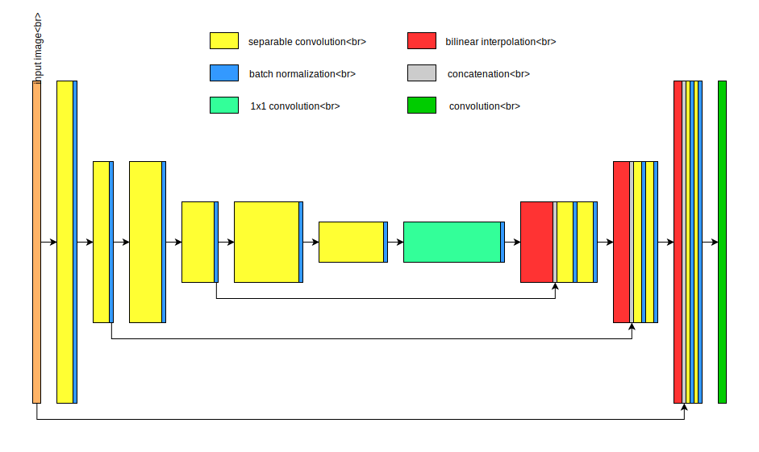

## Project: Follow Me

For this project a Fully Convolutional Network was designed. A dozen of model trainings were performed and decisions were made based on the resulting data. A few first runs were made using 4-core CPU resources only. As network complexity and number of epochs were growing, it quickly became clear that it's almost impossible to gain satisfactory results within a reasonable time. Therefore AWS service with GPU resources was used for the further model development.

I started with a simple network architecture composed of a downsampling layer, a 1x1 convolution, an upsampling layer and a final convolution. Encoder comprises a separable convolution layer which extracts features from an input image (reduced parameters number simplifies the network and reduces overfitting). We can't use fully connected layers for the project because we need to preserve spatial information (every pixel in an image have to be classified). That's why we use 1x1 convolution instead. Decoder upsamples the input feature map using bilinear interpolation. Skip connection via concatenation after upsampling allows to use data from the input high resolution image. Additional separable convolution applied after concatenation. Nonlinearity is introduced by ReLu. After every convolution a batch normalization applied to provide better convergence and normalization. Final convolution provides classification probabilities for every pixel.

Random search method was used for choosing starting hyperparameters. For the very first runs only 2 to 10 epochs where used and a relatively small part of the data provided. For `learning rate > 0.05`, `batch <= 16` and `filter number <= 16` `loss` and `validation loss` values were unstable and showed bad convergence or even divergence. With high number of batches (up to 256) and encoder/decoder filters (up to 512) the network performed just a little bit better. Increasing the separable convolution kernel size up to 10x10 gave slightly better results but not enough to consider them satisfactory. Additionally I analyzed popular FCN designs for semantic segmentation and came to a conclusion that hyperparameters should be limited to `learning rate = [0.3, 0.001]`, `batch = [32, 64]` and `filter number = [32, 1024]` for further investigation.

On the next step of the FCN development I doubled the number of encoder and decoder layers. The resulting network (2 downsampling layers, 1x1 convolution, 2 upsampling layers, final convolution) showed better results but they still were unacceptable.

The final FCN architecture comprises of 3x(separable convolutional layer -> separable convolutional downsampling layer), 1x1 convolution layer, 3x(upsampling layer with 2 convolutions), final convolution:



```
_________________________________________________________________
Layer (type)                 Output Shape              Param #   
=================================================================
input_1 (InputLayer)         (None, 160, 160, 3)       0         
_________________________________________________________________
separable_conv2d_keras_1 (Se (None, 160, 160, 32)      155       
_________________________________________________________________
batch_normalization_1 (Batch (None, 160, 160, 32)      128       
_________________________________________________________________
separable_conv2d_keras_2 (Se (None, 80, 80, 32)        1344      
_________________________________________________________________
batch_normalization_2 (Batch (None, 80, 80, 32)        128       
_________________________________________________________________
separable_conv2d_keras_3 (Se (None, 80, 80, 64)        2400      
_________________________________________________________________
batch_normalization_3 (Batch (None, 80, 80, 64)        256       
_________________________________________________________________
separable_conv2d_keras_4 (Se (None, 40, 40, 64)        4736      
_________________________________________________________________
batch_normalization_4 (Batch (None, 40, 40, 64)        256       
_________________________________________________________________
separable_conv2d_keras_5 (Se (None, 40, 40, 128)       8896      
_________________________________________________________________
batch_normalization_5 (Batch (None, 40, 40, 128)       512       
_________________________________________________________________
separable_conv2d_keras_6 (Se (None, 20, 20, 128)       17664     
_________________________________________________________________
batch_normalization_6 (Batch (None, 20, 20, 128)       512       
_________________________________________________________________
conv2d_1 (Conv2D)            (None, 20, 20, 1024)      132096    
_________________________________________________________________
batch_normalization_7 (Batch (None, 20, 20, 1024)      4096      
_________________________________________________________________
bilinear_up_sampling2d_1 (Bi (None, 40, 40, 1024)      0         
_________________________________________________________________
concatenate_1 (Concatenate)  (None, 40, 40, 1088)      0         
_________________________________________________________________
separable_conv2d_keras_7 (Se (None, 40, 40, 128)       149184    
_________________________________________________________________
batch_normalization_8 (Batch (None, 40, 40, 128)       512       
_________________________________________________________________
separable_conv2d_keras_8 (Se (None, 40, 40, 128)       17664     
_________________________________________________________________
batch_normalization_9 (Batch (None, 40, 40, 128)       512       
_________________________________________________________________
bilinear_up_sampling2d_2 (Bi (None, 80, 80, 128)       0         
_________________________________________________________________
concatenate_2 (Concatenate)  (None, 80, 80, 160)       0         
_________________________________________________________________
separable_conv2d_keras_9 (Se (None, 80, 80, 64)        11744     
_________________________________________________________________
batch_normalization_10 (Batc (None, 80, 80, 64)        256       
_________________________________________________________________
separable_conv2d_keras_10 (S (None, 80, 80, 64)        4736      
_________________________________________________________________
batch_normalization_11 (Batc (None, 80, 80, 64)        256       
_________________________________________________________________
bilinear_up_sampling2d_3 (Bi (None, 160, 160, 64)      0         
_________________________________________________________________
concatenate_3 (Concatenate)  (None, 160, 160, 67)      0         
_________________________________________________________________
separable_conv2d_keras_11 (S (None, 160, 160, 32)      2779      
_________________________________________________________________
batch_normalization_12 (Batc (None, 160, 160, 32)      128       
_________________________________________________________________
separable_conv2d_keras_12 (S (None, 160, 160, 32)      1344      
_________________________________________________________________
batch_normalization_13 (Batc (None, 160, 160, 32)      128       
_________________________________________________________________
conv2d_2 (Conv2D)            (None, 160, 160, 3)       99        
=================================================================
Total params: 362,521
Trainable params: 358,681
Non-trainable params: 3,840
```

This network better suits the idea of edges -> shapes -> objects feature extraction. However, a lot of layers and filters lead to a lot of calculations. The network gives acceptable results even with the default data set (`final_score = 0.447` when `num_epochs = 100`). Fixing the number of epochs to 20 and using the grid search method I ended up with the following hyperparameters:
```
kernel = 3
learning_rate = 0.005
batch_size = 64
```
For this small number of epochs with the default data set I got `final_score = 0.424`. The usage of additional 512 samples collected within the simulator's `DL Training` mode has leaded to a noticeable improvement. For the same hyperparameters but with the expanded data set I got `final_score = 0.4597`

The model is limited to identify the hero and the specific environment. For following another object a specific data set has to be collected and hyperparameters have to be tuned for training a new model. Another network architecture might better suit a different data set.

If I continued to work on this project, I'd collect much more data because it is very promising technique. The next step would be fine tuning of the learning rate. Epochs should be increased until `loss` and `validation loss` values start to diverge (to prevent overfitting). It also worth to try Bayesian optimization or other methods for automatic hyperparameter tuning. It might be better to concatenate decoder layers to `encoded_layer_1`, `encoded_layer_3` and `encoded_layer_5` instead of `inputs`, `encoded_layer_2` and `encoded_layer_4`